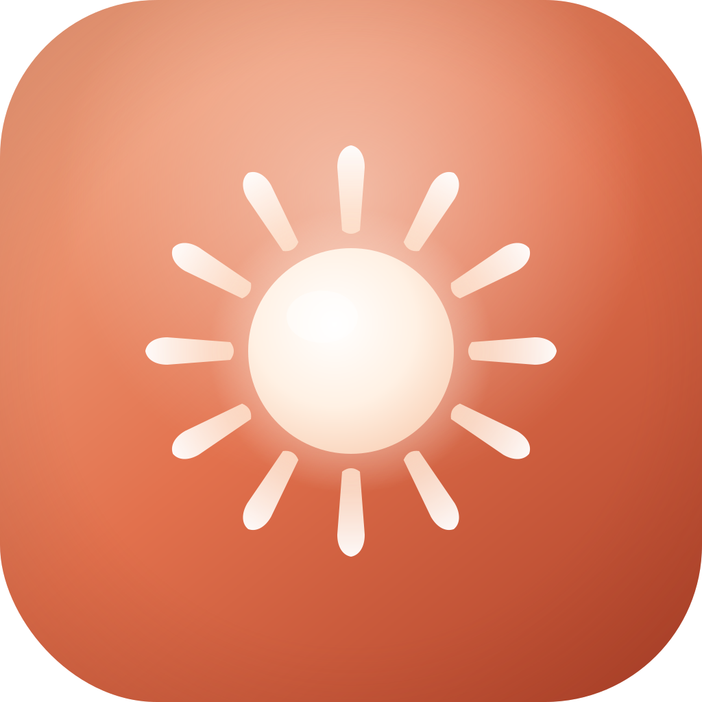

<div align="center">



# Radia Website

**Scan your skin. Unlock your glow.**

The marketing site and landing page for Radia, an AI skin analysis app that reads your face from a single selfie and turns it into a Glow Score, a personalized routine, and a 24/7 AI skincare coach. The Radia iOS app shipped build 10 to TestFlight in July 2026, and this site is its front door.


</div>

## What it does

This repo is a complete, ten page static website for Radia:

- Sells the product: hero with an animated face scan mockup, feature sections for the Glow Score, personalized routines, and the AI coach, social proof, and App Store and Google Play calls to action.
- Answers the hard questions: dedicated Science, Security, Privacy, Terms, and FAQ pages, because a skincare app that reads face photos owes users straight answers.
- Feels premium: a shared motion engine drives scroll-linked reveals, cursor-reactive glow, parallax phones, and spring count-ups across every page.

The whole thing is plain HTML, CSS, and JavaScript. There is no framework, no bundler, no package.json, and nothing to install.

## Why it's different

| | Typical startup landing page | Radia website |
|---|---|---|
| Build step | Next.js or Vite, node_modules, CI build | None. Open the HTML file. |
| Dependencies | Dozens of npm packages | 3 CDN scripts: GSAP, ScrollTrigger, Lenis |
| Motion | All-or-nothing fade-ins, or none | Scroll-linked scrubbing, cursor-follow glow, magnetic buttons |
| Motion resilience | Breaks if JS fails | Feature-detected: falls back to IntersectionObserver, then to static |
| Accessibility | Often an afterthought | Honors prefers-reduced-motion: everything renders instantly, animations run zero |
| Trust pages | Privacy page, maybe | Science, Security, Privacy, Terms, FAQ, all written for a face-photo product |

## Architecture

```
                         Browser
                            |
   +------------------------+------------------------+
   |                        |                        |
   v                        v                        v
+-----------------+  +-----------------+  +--------------------+
|  Static pages   |  |  Design system  |  |   Motion engine    |
|                 |  |                 |  |    (motion.js)     |
|  index.html     |  |  styles.css     |  |                    |
|  about.html     |  |  motion.css     |  |  GSAP 3.12         |
|  pricing.html   |  |                 |  |  + ScrollTrigger   |
|  faq.html       |  |  Hanken Grotesk |  |  + Lenis 1.1       |
|  science.html   |  |  + Quicksand    |  |  (jsDelivr CDN)    |
|  security.html  |  |  (Google Fonts) |  |        |           |
|  privacy.html   |  +-----------------+  |        v           |
|  terms.html     |                       |  CDN missing?      |
|  contact.html   |  +-----------------+  |  IntersectionObs.  |
|  404.html       |  |     assets/     |  |        |           |
+-----------------+  |  icons, phone   |  |        v           |
                     |  screenshots    |  |  reduced motion?   |
                     +-----------------+  |  show everything   |
                                          +--------------------+

  Any static host serves this: GitHub Pages, Netlify, Vercel, S3, nginx.
```

The motion engine degrades in three tiers. If GSAP loads, you get the full scroll-linked experience. If the CDN fails, a plain IntersectionObserver handles reveals. If the visitor prefers reduced motion, every element is shown immediately and no animation runs at all.

## Features

**Pages**
- `index.html`: hero with a live scanning phone mockup, stat strip, three feature sections (instant analysis, personalized routines, AI coach), how-it-works steps, testimonials, final CTA.
- `pricing.html`: free tier and premium plans.
- `science.html`: the evidence-based methodology behind the skin analysis.
- `security.html`: how face photos are handled, written for a biometric-adjacent product.
- `about.html`, `faq.html`, `contact.html`, `privacy.html`, `terms.html`, and a branded `404.html` ("Lost your glow?").

**Motion system** (one shared `motion.js`, 139 lines)
- Lenis smooth scroll synced to GSAP's ticker, with anchor links gliding through it.
- Scroll-triggered staggered reveals on every `.reveal` element.
- Hero glow that idles with a breathing pulse, follows the cursor, and parallaxes on scroll.
- Looping scan-line animation on the hero phone.
- Per-section phone parallax with scrubbed ScrollTrigger.
- Spring count-ups on every `[data-count]` stat.
- Magnetic primary buttons with elastic snap-back.
- Nav bar blur that toggles at 12px of scroll.

**SEO and sharing**
- Per-page titles, meta descriptions, and Open Graph tags on the landing page.

**Compliance posture**
- Every page carries the disclaimer: Radia provides cosmetic skincare guidance only, not medical advice.

## Quickstart

```bash
git clone https://github.com/s-k-28/radia-website.git
cd radia-website

# Option 1: just open it
open index.html

# Option 2: serve it locally
python3 -m http.server 8000
# then visit http://localhost:8000
```

That is the entire setup. No install, no build, no environment variables.

## Tech stack

| Layer | Choice | Why |
|---|---|---|
| Markup | Hand-written HTML5, 10 pages | Full control, zero framework overhead |
| Styling | `styles.css` design system + `motion.css` | Coral and ivory palette, CSS custom properties |
| Type | Hanken Grotesk (UI), Quicksand (display) | Loaded from Google Fonts with preconnect |
| Animation | GSAP 3.12.5 + ScrollTrigger | Scroll-linked scrubbing instead of binary fades |
| Scrolling | Lenis 1.1.14 | Smooth scroll synced to the GSAP ticker |
| Delivery | jsDelivr CDN, no bundler | The site stays a plain static folder |
| Hosting | Any static host | GitHub Pages, Netlify, Vercel, S3 all work |

## Project structure

```
radia-website/
├── index.html          # Landing page: hero, features, how it works, reviews, CTA
├── about.html          # Company story
├── pricing.html        # Free and premium plans
├── faq.html            # Frequently asked questions
├── science.html        # Evidence-based methodology
├── security.html       # Face photo and data handling
├── privacy.html        # Privacy policy
├── terms.html          # Terms of service
├── contact.html        # Contact page
├── 404.html            # Branded not-found page
├── styles.css          # Design system: tokens, layout, components
├── motion.css          # Motion-specific styles and reveal states
├── motion.js           # Shared motion engine (GSAP + ScrollTrigger + Lenis)
└── assets/             # App icon, phone screenshots, premium art
    ├── radia-icon.svg
    ├── results.png     # Glow Score results screen
    ├── onboarding.png  # Skin profile onboarding
    ├── coach.png       # AI coach chat
    ├── today.png
    └── shop.png
```

---

<div align="center">

Cosmetic skincare guidance only. Radia is not a medical device and is not a substitute for professional medical advice.

</div>
